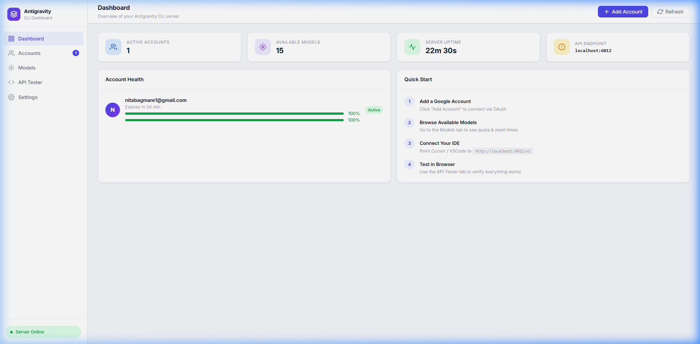
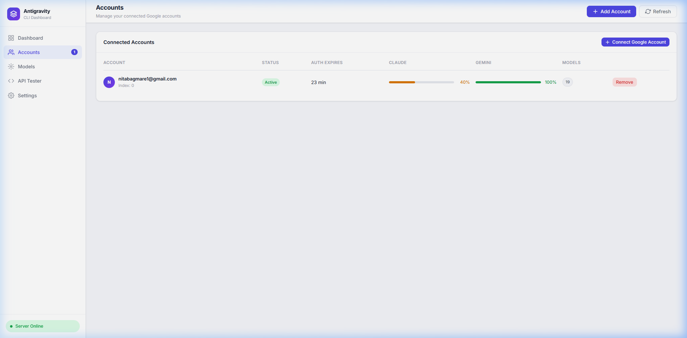
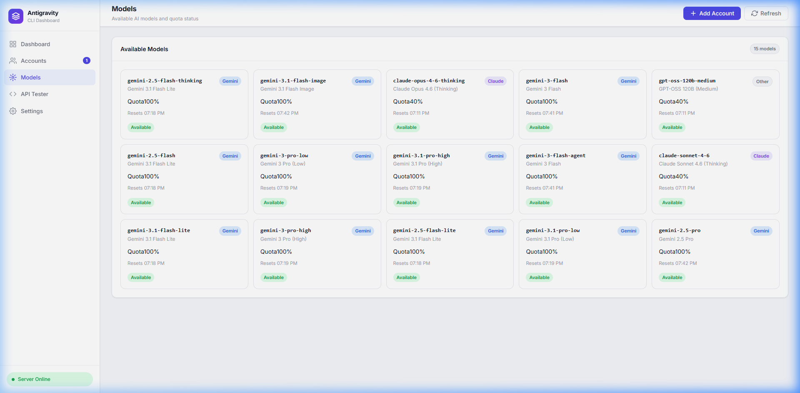
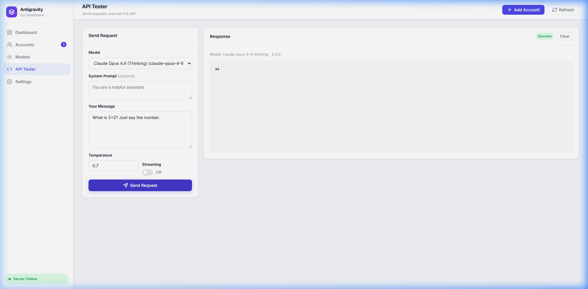
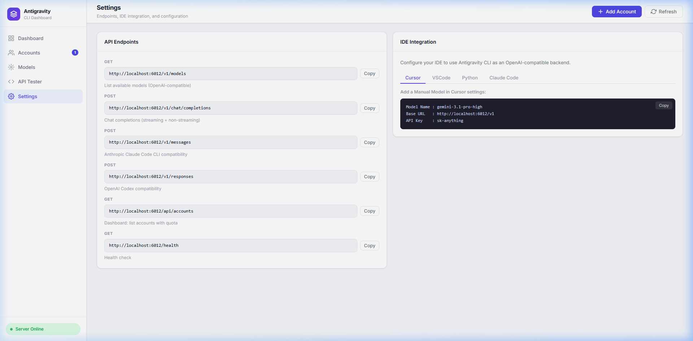

# Antigravity CLI

> **Use Claude Opus, Gemini Pro and 15+ premium AI models anywhere — Cursor, VSCode, Claude Code, terminal scripts, or any OpenAI-compatible tool.**

Your **Google One AI Premium** subscription gives you unlimited Claude and Gemini access inside the Antigravity IDE. This tool breaks that wall: it runs a local API server that mimics OpenAI's format, so any tool can use those same models — with a full web dashboard to manage accounts and test requests in your browser.

---

## ✨ What's new in v2.0

- 🌐 **Full Web Dashboard** — manage accounts, browse models, test the API — all from your browser at `http://localhost:6012`
- 📊 **Live Quota Bars** — see exactly how much quota remains per model per account, with reset times
- 🔐 **Browser Login** — add Google accounts without touching the terminal
- 🔄 **19+ Live Models** — fetched dynamically from the Antigravity API (not a hardcoded list)
- ⚡ **SSE Streaming** — real-time response streaming compatible with all tools

---

## 📸 Dashboard Preview

**Dashboard — server status, account health at a glance**


**Accounts — manage multiple Google accounts, see quota per model**


**Models — all 19+ live models with quota %, reset times, exhausted badges**


**API Tester — send requests and see responses directly in the browser**


**Settings — copy-paste endpoints and IDE integration snippets**


---

## 🚀 Quick Start

### 1. Install

```bash
git clone https://github.com/YOUR_USERNAME/antigravity-cli.git
cd antigravity-cli
npm install
```

**Requirements:** Node.js v18+ · Google One AI Premium account

---

### 2. Start the server

```bash
node index.js serve
# or: npm run dev
```

```
  🌐 ANTIGRAVITY CLI  ONLINE

  UI       : http://localhost:6012          ← open this in your browser
  Models   : http://localhost:6012/v1/models
  Chat     : http://localhost:6012/v1/chat/completions
  Health   : http://localhost:6012/health
```

---

### 3. Add your Google account

**Option A — via the UI (recommended):**
1. Open `http://localhost:6012` in your browser
2. Click **Add Account** in the top bar
3. Sign in with your Google One AI Premium account
4. The dashboard updates automatically ✅

**Option B — via terminal:**
```bash
node index.js login
```

> 💡 Run login multiple times (or click Add Account multiple times) to add more accounts. The server auto-rotates between them when one is rate-limited.

---

### 4. Connect your IDE or tool

| Setting | Value |
|---------|-------|
| **Base URL** | `http://localhost:6012/v1` |
| **API Key** | `anything-for-you-bro` (any string, not validated) |
| **Model** | any ID from `/v1/models` |

**Cursor:** Add a manual model in Settings → Models → `+`

**Claude Code CLI:**
```bash
export ANTHROPIC_BASE_URL="http://localhost:6012/v1"
export ANTHROPIC_API_KEY="anything-for-you-bro"
claude
```

**Python (openai SDK):**
```python
from openai import OpenAI

client = OpenAI(base_url="http://localhost:6012/v1", api_key="anything-not-validated")

for chunk in client.chat.completions.create(
    model="gemini-3.1-pro-high",
    messages=[{"role": "user", "content": "Hello!"}],
    stream=True
):
    print(chunk.choices[0].delta.content or "", end="")
```

**curl:**
```bash
curl -X POST http://localhost:6012/v1/chat/completions \
  -H "Content-Type: application/json" \
  -d '{"model":"gemini-3.1-pro-high","messages":[{"role":"user","content":"Hi"}],"stream":false}'
```

---

## 📋 All CLI Commands

| Command | Description |
|---------|-------------|
| `node index.js serve` | Start the server + dashboard on port 6012 |
| `node index.js serve --port 8080` | Custom port |
| `node index.js login` | Add a Google account (terminal OAuth) |
| `node index.js models` | List all available models in terminal |
| `node index.js status` | Check token validity and quota per account |
| `node index.js ask "..."` | Ask a question directly from terminal |
| `node index.js ask -m gemini-3.1-pro-high "..."` | Ask with specific model |

---

## 🤖 Available Models

Models are fetched **live** from the Antigravity API on every request. Common ones:

| Model ID | Display Name |
|----------|-------------|
| `gemini-3.1-pro-high` | Gemini 3.1 Pro (High Quality) |
| `gemini-3.1-pro-low` | Gemini 3.1 Pro (Low Latency) |
| `gemini-2.5-pro` | Gemini 2.5 Pro |
| `gemini-3-flash-agent` | Gemini 3 Flash |
| `claude-opus-4-6-thinking` | Claude Opus 4.6 (Thinking) |
| `claude-sonnet-4-6` | Claude Sonnet 4.6 (Thinking) |
| `gpt-oss-120b-medium` | GPT-OSS 120B |

> Run `node index.js models` or visit the **Models** tab in the dashboard for the full live list with quota info.

---

## 🔄 Multi-Account Rotation

```
Request → Check Account 1 quota
               ├─ < 95% used → Send request ✅
               └─ > 95% used → Skip → Check Account 2 → ...
                                           └─ All exhausted → Return error with reset times
```

- Auto-switches accounts **before** hitting quota limits
- Token auto-refreshes every hour without any action from you
- Add as many accounts as you want — the more accounts, the higher your combined quota

---

## 🌐 API Endpoints

| Method | Endpoint | Description |
|--------|----------|-------------|
| `GET` | `/v1/models` | List models (OpenAI format) |
| `POST` | `/v1/chat/completions` | Chat (OpenAI format, streaming + non-streaming) |
| `POST` | `/v1/messages` | Chat (Anthropic Claude Code format) |
| `POST` | `/v1/responses` | Chat (OpenAI Codex/Responses format) |
| `GET` | `/api/accounts` | Account list with quota (dashboard API) |
| `POST` | `/api/login` | Start OAuth login flow (returns URL) |
| `DELETE` | `/api/accounts/:index` | Remove an account |
| `GET` | `/health` | Health check |

---

## 📁 Project Structure

```
antigravity-cli/
├── index.js          # CLI: login, serve, ask, status, models commands
├── api-server.js     # Express server — OpenAI + Anthropic API + dashboard API
├── auth.js           # Token management & auto-refresh
├── public/
│   ├── index.html    # Web dashboard SPA
│   ├── style.css     # Premium white ERP-style theme
│   └── app.js        # Dashboard JS — live polling, account mgmt, API tester
├── docs/images/      # Screenshots for README
├── keys.json         # 🔒 Your tokens (auto-generated, gitignored)
├── config.example.json
└── prompts.json      # Example batch questions
```

---

## ⚠️ Important Notes

- **`keys.json` is gitignored** — it contains your personal Google OAuth tokens. Never share or commit it.
- Requires an active **Google One AI Premium** subscription for Claude and Gemini Pro access.
- The API runs on **localhost only** — not exposed to the internet by default.
- This project is intended for **personal / educational use**.

---

## 📄 License

MIT © 2026

---

<p align="center">
  <b>Antigravity CLI</b> — Use Claude & Gemini anywhere. Not just inside an IDE. 🧠⚡
</p>
